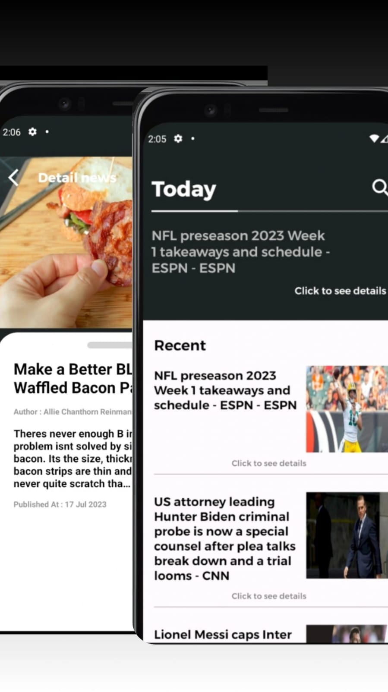

# News App

A brief description of what your project does.

## Table of Contents
 
- [Features](#features) )
- [License](#license)
 
## Features
   - Home News 
   - Search Features
   - Detail Features
## License

Indicate the license under which your project is released. For example:

This project is licensed under the [MIT License](LICENSE).
